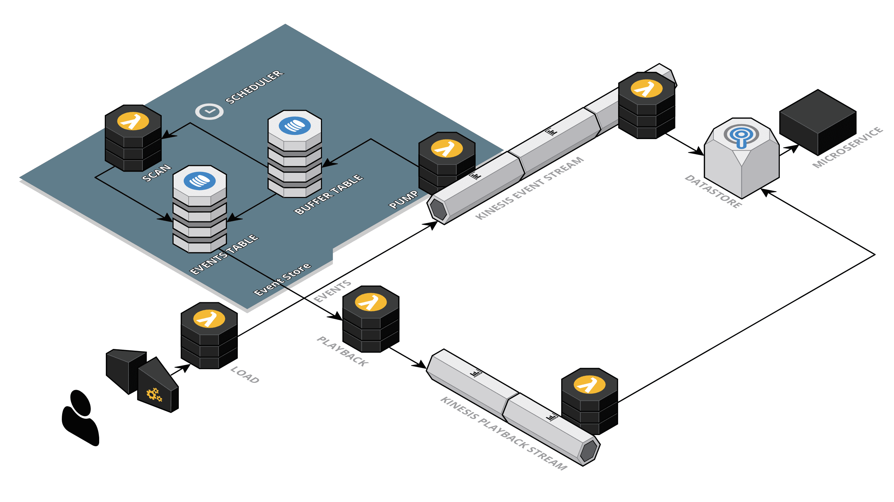

# dynamodb-event-store
Simple Event Store for DynamoDB


## What is it?
This is a proof of concept implementation to store a log of time based events (in this case from Kinesis) to a NoSQL database like DynamoDB. While it's certainly not ready for production use (you have been warned), it could evolve into a robust solution easily.

The idea is to be able to store events when they are happening, and to have a way to play them back sequentially from an arbitrary point in time. This is very useful for Event Sourcing.

The problem with storing time based events in DynamoDB, in fact, is not trivial. The main issue is that using a naive partition key/range key schema will typically face the [hot key/partition problem](https://docs.aws.amazon.com/amazondynamodb/latest/developerguide/GuidelinesForTables.html), or size limitations for the partition, or make it impossible to play events back in sequence.


### Naive solutions:

**Random partition key and time based range key** 

|Partition Key|Range Key|Data|
|----|----|----|
|379d96af-5058-401f-ab7c|2018-03-04T14:59:44.810Z|{"foo":12}| 
|cf046f75-beb6-414c-b0ba|2018-03-04T14:59:44.321Z|{"foo":31}| 
|c115d8ac-205e-4ed7-8f86|2018-03-04T14:59:44.030Z|{"foo":10}| 

This provides an optimal resource utilization, as writes are spread across partitions, but it becomes very difficult to play back event in sequence, because the partition key is random, and therefore it cannot be guessed to rebuild the original time sequence. Also note that using secondary global indexes would just move the hot partition problem to the index tables.


**Predictable partition key and time based range key**
|Partition Key|Range Key|Data|
|----|----|----|
|2018-03-04T14:59:44.000Z|2018-03-04T14:59:44.030Z|{"foo":10}| 
|2018-03-04T14:59:44.000Z|2018-03-04T14:59:44.321Z|{"foo":31}| 
|2018-03-04T14:59:44.000Z|2018-03-04T14:59:44.810Z|{"foo":12}| 

This makes it easy to scan the table, with a predictable partition key (based on a second resolution), but the writes are happening at the same time, during the same second, on the same partition, making it "hot" and likely exceeding the provisioned throughput. Increasing the throughput would still not be a full solution to the problem, as each partition just gets a slice of the total provision throughput, depending on the number of partitions in use. Since each partition is 10GB, eventually the table will grow to hundreds of partitions, and any increase in throughtput will benefit for only a small percentual.

### This implementation:
The idea is to actually combine the two naive solutions above, into one that is *less naive* and provides both optimal write performances and easy event playback and ordering.

One *buffer* table is used to write events using a quasi-random partition key, with a timestamp as another colunmn (doesn't need to be a range key). Periodically, say every minute, the buffer table is scanned and records are moved into the *event* table, with a partition key that is predictable as in the naive example before (timestamp at the second resolution), and the full timestamp as range key. Because the scan operation on the buffer table returns records in random order, writes are spread across potentially 60 different partitions (in case of scan every minute), therefore avoiding or reducing hot partitions.

Depending on the frequency of events, and hence the rate of writing, you can use a different time resolution and a different scan period. For instance, for a lower event frequency, the time unit could be set to 1 minute, and the scan period increased to 10 minutes.
In this way, events will be moved from the buffer table to the event table evey ten minutes, and writes will be spread across 10 partitions.

All of this is implement purely in Serverless Lambda, without the need to provision anything but the tables and the kinesis stream.

Please note that in this POC, the partion key used for the buffer table is actually a `sha256` of the kinesis message. This allow to handle failures, as the *pump* lambda will just retry to update the same record in case a failure  writing to dynamo (which in turn would cause the lambda to restart reading events from the stream). 

To load test, there's also an ApiGateway *load* lambda that can be invoked with something like apache benchmark and returns a single pixel after having pushed the request object data in kinesis.  For instance, running:

```bash
ab -k -n 1000 -c 10  https://xxxx.execute-api.us-east-1.amazonaws.com/dev/track.gif
```

you will be pushing 1,000 events into kinesis and the dynamodb event store. 

You could also put the url in a web page in a higly trafficed site with something like the following:
```html

```
and push actual click stream data into your event store.

### How to run it
The code is written using the serverless framework, so just install it with:
```bash
npm -g install serverless
```
Then, clone this project, install all the dependencies and deploy: 
```bash
npm install && sls deploy
```
At the end, the tables, the kinesis stream and the lambda functions are deployed, and you can start using it. Just using a simple curl command:
```bash
curl -v https://xxxx.execute-api.us-east-1.amazonaws.com/dev/track.gif
```
and then verify that records are placed in the buffer table and then moved to the event table.

### Notes
This project is also using AWS x-ray to provide resource utilization metrics.
The default capacity set for the DynamoDB *buffer* table is 100 reads, 100 writes. The capacity for the event table is 10 reads, 50 writes. This can be adequate for a small to medium load.
Using DynamoDB autoscaling may also work well for moderately spiking load.
